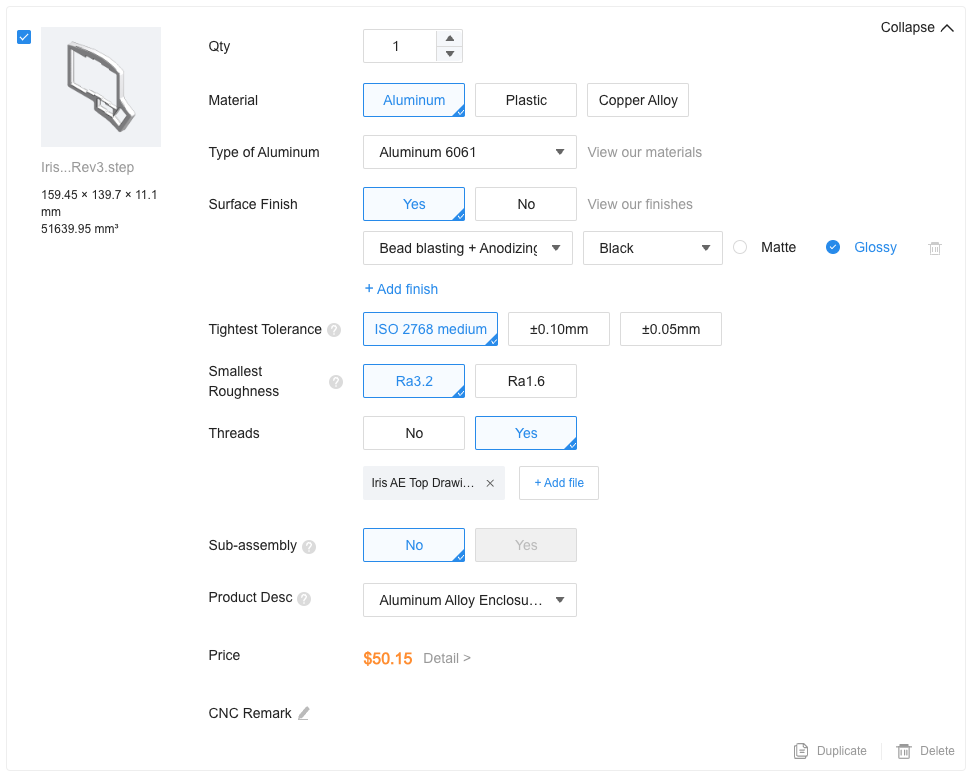

# Iris AE Aluminum Keyboard Case

With the discontinuation of the Iris AE Aluminum Case, the case files are being released for people to have their own case made.

These files are being provided as-is, and no additional support will be provided for use of them.

## Case Parts

The Iris AE case consists these pieces:

- Switch plate - 1.5mm thick
- Top Piece
- Bottom Piece
- [Silicone Tray Inserts](https://keeb.io/products/iris-aluminum-case-silicone-tray-insert)

Additional parts used:

- 8x [6mm M2 screws](https://s.click.aliexpress.com/e/_opXvJPD)
- 16x [12mm M3 screws](https://s.click.aliexpress.com/e/_opXvJPD)
- 16x O-rings - 4mm OD (Outer Diameter), 2mm ID (Inner Diameter), 1mm CS (Cross Section)
  - [AliExpress Listing for O-rings](https://s.click.aliexpress.com/e/_op6d4Cr) (Select `OD4-ID2`)
- [SKUF Feet](https://keeb.io/products/skuf-silicone-rubber-keyboard-feet)

## Fabrication

The top and bottom piece STEP files for the aluminum case can be submitted to various places. Exact details on ordering will vary depending on manufacturer.

### Example ordering with JLC CNC service

- Go to [JLCCNC](https://jlccnc.com/cnc-machining-quote)
- Upload STEP files
- Select Surface Finish (usually you will want `Bead blasting + Anodizing` with `Glossy` Color)
- Select `Yes` for Threads and upload the corresponding PDF drawing for that piece

## License

These case files are released under the MIT License.
